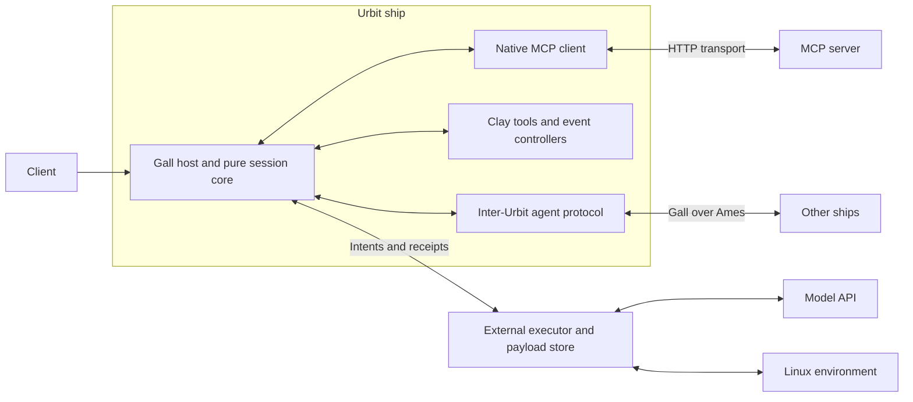

# Harness on Urbit: working design notes

These notes develop the [proposal](README.md) and the decisions in the [roadmap](ROADMAP.md). The roadmap sets delivery order; this document explains the architecture, contracts, and open choices behind it. The types and protocols below are design sketches, with room for the people implementing them to improve the details.

The **head** is the session state machine: it admits input, maintains context, decides what happens next, and records outcomes. The **hands** perform model inference and interact with execution environments and external services. **Mars** refers to Arvo running in the serf; **Earth** refers to the runtime's I/O side. An external executor can run beside the ship or on another machine.

## 1. Design commitments and delivery order

The useful lesson from [Lightspeed][lightspeed] and [AgentOS][agentos] is that the head can remain small even when the agent's capabilities grow. Urbit supplies durable state and an event/effect boundary; the harness supplies session semantics and the contracts for outside work.

- **Start with coding.** Reuse established terminal and editing interfaces that coding models are already trained to use. This makes Unix tools mainly an implementation task; reliable native Urbit tool shapes require more design and evaluation. Real files, a shell, one faithful model API, and automatic compaction come first. [Tool-design guidance][coding-tools].
- **Keep decisions deterministic.** A pure Hoon library applies events to session state and emits effect intents. A Gall agent hosts it and routes results back. Model calls and Unix execution happen outside the reducer.
- **Retain native provider data.** Store the provider's output and continuation items intact. Extract only the fields the head needs to branch; avoid turning every API into a common text-message format.
- **Make work identifiable.** Inputs, attempts, model turns, and external operations need stable identities. Recording an operation and receiving its result are separate events.
- **Keep ordinary events small.** Use retained payload references for large bodies and bounded reads for inspection. Do not reserialize the full transcript on every turn.
- **Let the harness evolve.** Tools, skills, prompts, configurations, and eventually the harness implementation itself are versioned software. A stable core contract supports tested upgrades; it does not make the implementation permanently fixed.

| Milestone | Technical commitment |
|---|---|
| 1 — Coding agent | Multiple independent sessions, one active task per session, per-session capability grants, Responses, native compaction, a Linux executor, core coding tools, and Harbor evaluation. |
| 2 — Full agent experience | Run control and recovery, Chat Completions then Messages, subagents, promises/jobs, a native MCP client, and richer inputs. Resolve initial skills hosting here. |
| 3 — Native development and collaboration | Clay tools and skills, harness upgrades, capability bundles, our own inter-Urbit agent protocol, and native automation. |

The [existing harness][harness] already prototypes features from several milestones. This is the order in which to make the complete experience work, not a claim that every component must be built from scratch.

## 2. Where each responsibility lives



The diagram shows the eventual system. Milestone one needs the client, session core, executor, model API, and Linux environment.

The model adapter owns provider request assembly, wire formats, credentials, retries, and response decoding. The environment adapter owns filesystem and process operations. These can share one executor process initially, but their contracts are distinct.

The native MCP client is a deliberate addition on the ship in milestone two: Hoon owns the MCP protocol state and interpretation. HTTP/TLS, credential injection, and buffering can still use runtime transport support. “Provider parsing lives outside the head” should not become a rule that prevents implementing an Urbit-native protocol client.

Keep three protocols distinct: **head to executor**, **executor to environment**, and **harness to peer harness**. They serve different purposes and can evolve independently. Neither the environment protocol nor an external agent standard should dictate the head's session model.

## 3. Sessions, context, and effects

### Per-session capabilities from milestone one

Follow Lightspeed's sparse `SessionConfig.features` model: the user or creating controller enables and configures tool families; an absent feature grants nothing. Environment tools, jobs, subagents, and MCP are separately configurable. Derive the session's toolset from that configuration and enforce it when dispatching calls. [Configuration contract][ls-config].

Start with creation-time grants in milestone one; controlled updates can follow in milestone two. Pin their revision for each turn, including permitted targets and operations where applicable. Installing or authoring a bundle makes it available to grant, not automatically enabled for every session. A session cannot expand its own permissions merely by changing its tool catalog. Urbit development grants must identify which ships/desks it may modify, with remote work also subject to the receiving ship's permissions.

### The small milestone-one session

A session holds identity, lifecycle, API kind, model configuration, an environment reference, history, the active context revision, and outstanding operations. Each task has an attempt ID and a terminal result. That small attempt record can become the richer run model in milestone two.

Task completion leaves an **open, idle** session. Closing an idle session makes input admission terminally unavailable; deletion is a separate operation allowed only after closure. Milestone one accepts one task and works until completion or failure. Conversational continuations, steering, queues, and force-close/cancellation controls come later. This follows [Lightspeed's lifecycle contract][ls-api] without importing its whole control surface at once.

Several sessions can have model requests or commands in flight simultaneously. Their state transitions still run as individual ship events, so each event must do bounded work. Maintain derived state incrementally and use replay to verify it, rather than folding the entire history for each transition. Session concurrency does not imply parallel execution of Hoon within one event.

Keep the durable history separate from the active model context. Compaction changes which retained items the model sees; it does not erase the history or reset task accounting. Expose session status, terminal reasons, and bounded history reads through scries and a thin client interface.

### The effect boundary

A useful initial envelope is:

```text
Intent  = version, session-id, task-id, operation-id, kind,
          context/config revision, target-id, input-reference
Receipt = version, operation-id, status, output-reference,
          usage/error metadata, process-handle or tool-call descriptors
```

Names are illustrative. The important rule is to record the operation and its frozen inputs before dispatch. A receipt is admitted only against the matching pending operation. Duplicate or late receipts cannot settle another task or rerun completed siblings in a tool batch. Replay reconstructs decisions without replaying external commands.

Milestone one needs this correlation and honest failure reporting. Milestone two adds full reconciliation after reconnects and restarts: query retained operation status, recover completed results, and distinguish unknown outcomes from known failures. A lost shell reply does not establish that the command never ran; only retry execution when its outcome and retry contract allow it.

Arvo's persistence preserves the head. It does not by itself preserve an external process or guarantee exactly-once effects. Keep receipts and process ownership explicit, and fail visibly while preserving saved data if an upgrade cannot read a state version.

## 4. Native model APIs and compaction

### Responses first

Implement the OpenAI Responses coding path faithfully before adding another API. Retain ordered output items, tool-call identities, native reasoning/continuation data, stop conditions, usage, and errors. The adapter renders valid next-request items from that retained data. Opaque reasoning is continuation state, not text for the harness to interpret. [Reasoning reference][openai-reasoning].

Prefer a design that can reconstruct requests from retained native items, rather than depending exclusively on provider-hosted conversation state. Fix the API kind within a session initially. Switching APIs should create a new session or use an explicit context-conversion operation; it must not silently reinterpret an existing transcript.

“Complete Responses support” means the requirements of the coding loop work end to end. It does not bring every optional hosted tool, media type, or interactive client feature into milestone one.

### Compaction is a state transition

OpenAI supports automatic server-side compaction and an explicit `/responses/compact` endpoint. The explicit endpoint fits an initial head-controlled transition: freeze a context revision, request compaction before it exceeds capacity, then commit the returned window. Preserve the entire returned window, including retained items and the opaque compaction item. Server-side compaction needs its own adapter handling for compaction items returned during generation. [Compaction reference][openai-compaction].

Track requested, pending, committed, and failed compaction. Leave room for generation and tool results. A failed compaction retains the prior context; a stale result cannot replace a newer revision. Keep instructions, task constraints, and unresolved work available after the transition, and exercise repeated compaction on a long task. In milestone two, inputs arriving during compaction wait for the next valid context boundary.

### Broader APIs and model-specific tools

Add **OpenAI Chat Completions, then Anthropic Messages**, in milestone two. Keep each API's native items and reasoning conventions; put compaction and caching policy in the relevant adapter. Where native compaction is unavailable, use an explicit summarization policy rather than presenting it as equivalent provider behavior.

Separate tool implementation from model-facing presentation. The same process capability can be exposed as `exec_command`/`write_stdin` or a Claude-style `Bash` surface. Editing tools need model-appropriate schemas, instructions, and result formatting too. Pin the advertised toolset and its implementation revision for each turn. Preserve stable request prefixes between deliberate context changes, while allowing necessary instruction and catalog updates. [Lightspeed tool surfaces][ls-tools].

Images, documents, and web tools follow in milestone two. Retain original assets and their metadata, then render content in the selected provider's supported form. User-visible token streaming can follow the core controls; transient token frames need not become individual session-history entries.

## 5. The environment bridge and coding tools

A task needs a real Linux filesystem, shell, processes, development tools, and permitted network access. A workspace VFS or an on-ship JavaScript runtime does not replace that environment.

Prefer remote attachment so the ship and task machine can live separately. Lightspeed distinguishes providers that manage environments from daemons that expose an environment's operations. Its registered daemons connect outward to a gateway; its environment data protocol uses JSON-RPC over WebSocket. Reusing it directly is different from exposing a simple HTTP endpoint. [Environment design][ls-environments].

| Initial option | Consequence |
|---|---|
| HTTP adapter reached through Iris | A small bridge translates requests to the environment protocol and exposes status/results. Suitable for a remote provider; the adapter still has to be built. |
| Reuse Lightspeed's WebSocket protocol | Reuse its operation contracts and daemon, with a compatible bridge/runtime transport. Do not assume Iris supplies this unchanged. |
| Local sidecar over Lick | A local IPC bootstrap controlling the ship's host environment. Keep environment identity explicit so remote attachment can follow. |

Choose one before implementation. One attached existing environment is sufficient; provisioning fleets, automatic migration, and a provider marketplace are later work. A session references an environment by identity. Closing or forking a session must not implicitly destroy or copy a shared environment.

The minimum tool inventory is:

| Capability | Model-facing tools and behavior |
|---|---|
| Inspect | `list_dir`, `read_file`, `grep`, `glob`; bounded results and useful path/encoding errors. |
| Change files | `write_file`, `edit_file`, `apply_patch`; clear failed-match and patch errors. |
| Run commands and scripts | `exec_command`; working directory, environment, stdout/stderr, exit status, and interactive/PTY support. |
| Continue a process | `write_stdin`; later output, stdin, interruption, termination, and terminal status. |

All tools address the same filesystem. Git, compilers, package managers, and tests can run through the shell. Validate returned tool names and arguments against the granted toolset at dispatch; advertising a smaller schema list alone does not enforce it.

Separate a short **yield interval** from a **kill deadline**. A build that outlives the first response returns a process handle and continues. Bind handles to their originating environment, retain output behind cursors/references, and return bounded previews. These process primitives belong in milestone one; the broader jobs system follows in milestone two.

## 6. Run control, subagents, and efficient waiting

Milestone two expands the attempt model into explicit runs, with queued, active, waiting, cancelling, and terminal states. Keep admission IDs so client retries do not duplicate work.

- **Continue** starts another run in an open session.
- **Steer** admits input for the next turn boundary without changing the in-flight request. Unconsumed steering must still receive a turn even if the current response would otherwise finish.
- **Queue** admits a later run and exposes it as queued immediately.
- **Cancel** stops new dispatches, requests cancellation of outstanding work, and records the outcome. It does not remove earlier events.
- **Fork** copies history/context at a settled boundary and records lineage. Select a fresh, explicitly shared, or separately snapshotted environment; copying session state does not copy Linux processes or undo their effects.

These semantics are worked through in [Lightspeed's active-run design][ls-control].

Use one promise abstraction for asynchronous producers: environment jobs, child sessions, and eventually peer requests. A promise has an owner, producer identity, status, result reference, and optional deadline. `await` can wait for any or all of a set. A wait timeout releases the waiter; cancellation is a separate operation on the producer.

Lightspeed's `agent_run` joins a child result directly, while `agent_spawn` returns a promise for later `await`. Adapt that pattern using ordinary Urbit sessions with separate context, inherited or explicit configuration, lineage, and limits. Owned children normally terminate with their parent work; intentional detachment requires an explicit lifetime rule. [Subagent design][ls-subagents].

Background jobs let an environment run longer scripts or groups of operations and retain results near the work. Submit once, then receive completion as an event or await a promise. The model should not spend turns polling for liveness. Waiting suspends session work; Behn supplies deadlines, and transport adapters can perform any required status polling without invoking the model.

Keep usage, elapsed-time limits, and retry budgets outside compactable context. A failed command or test is normally information the model can use, not a reason to halt after an arbitrary small number of errors.

## 7. A native MCP client and the first skills model

### MCP belongs on the ship

Implement the MCP client as a Hoon component with Gall integration. It owns protocol version handling, request correlation, discovery, tool schemas and invocation, and result/error interpretation. Support resources and prompts where exposed; advertise only client capabilities that are implemented. Integrate calls into the same pending-effect and tool-result machinery as other tools.

Pin the first supported revision instead of targeting an unspecified “latest.” The **2026-07-28 Streamable HTTP** revision uses POST requests with required metadata and version headers. Responses can be JSON or request-scoped SSE; the client must accept both. It removes protocol-level sessions and the separate GET stream. Cancellation of an SSE request is signalled by closing that response stream. Omitting the obsolete HTTP+SSE transport does not eliminate SSE decoding. [Transport specification][mcp-transport].

Start with unauthenticated endpoints and configured API keys/static tokens. OAuth flows, legacy transport compatibility, and hosting an MCP server are deferred. A transport shim may handle TLS, bytes, buffering, and secret injection; MCP semantics remain in Hoon. Verify bounded chunk delivery and parsing with Iris/runtime support before committing to a particular transport implementation.

Keep configured secrets outside Arvo. The ship can hold an opaque credential binding while the transport resolves it at send time. Ordinary Hoon-built authorization headers would put the secret into ship state, so this separation requires explicit transport support; it is not provided merely by saying “use Iris.”

### Skills and media are separate from a VFS

A skill is discoverable instructions and supporting resources; it is not necessarily an executable tool. Load concise catalog metadata into context, fetch bodies on demand, and record the revision that was activated.

Milestone two leaves the initial storage choice open: files in the attached Unix environment are close to the coding workspace; on-ship storage survives environment replacement and leads toward native bundles. Define skill identity, revision, and resource lookup independently of location. Neither choice requires a custom VFS. Milestone three commits to Clay-backed native skills and explicit import/export of reusable bundles.

Likewise, retaining an uploaded image or document by reference does not require implementing a general workspace filesystem. Keep workspace files, skill packages, and immutable transcript/artifact storage as distinct concerns.

## 8. Native tools and harness self-development

In milestone three, enable an Urbit development environment per session, targeting its own ship or an explicitly authorized ship such as a moon. Its tools cover inspection, editing, builds, tests, and activation through **Clay desks**, **Hoon gates and libraries**, and **Gall agents**. They serve the same development needs as Unix tools, with native schemas and feedback. Finding shapes models use reliably is a new design problem to evaluate on real Urbit tasks.

Define a tool descriptor containing a stable name, description, input/result types, implementation entry point, required capabilities, and version. A new tool is compiled, tested, and registered before a subsequent turn can see it. Native dispatch can call a pure library function or send a typed request to a Gall agent; the descriptor should make that distinction explicit. Native tools share the ship's per-event work budget; long computations still belong outside it.

A toolbox combines those descriptors with skills, prompts, and reusable session configurations. Pin implementations while calls are outstanding; publishing an update must not silently change the meaning of a call already admitted by the model.

The self-development loop is concrete:

1. Write a candidate tool, skill, or harness change to a staging desk/revision.
2. Compile it and run focused tests.
3. Rehearse behavior against copied session state and representative tasks, with external effects stubbed or directed to a disposable environment.
4. Activate the tested version and record its identity and any state migration.

For harness upgrades, test the new pure session library as well as the Gall host's migration. Gall passes the old saved state to the rebuilt agent through `+on-load`; the harness must supply a valid migration and reject unsupported state without replacing it with empty state. A failed upgrade event can abort the commit, but this does not roll back outside work performed during earlier rehearsal events. [Gall upgrades][urbit-gall].

Package reusable capabilities as desks, with metadata for versions, dependencies, model-facing instructions, and tool registrations. Keep local customizations separate from upstream updates. Clay supplies software distribution; the harness still needs a bundle manifest and activation convention. [Desk distribution][urbit-dist].

For bundles received from another ship, show the owner the additions and changes and require approval before installation and activation. Keep this first approval flow simple. Broader isolation and validation work follows the end-to-end demonstration; it should not displace building the system that the demonstration proves.

## 9. Our own inter-Urbit agent protocol

Agent communication is a milestone-three capability in its own right, alongside sharing code. Build an application protocol around Urbit identities, durable sessions, asynchronous work, and native capabilities. **Do not adopt A2A or ACP as the contract between ships.** An A2A adapter can later expose compatible operations to outside agents while the native protocol evolves independently.

Use versioned nouns and marks carried by Gall interactions over Ames. Gall provides the route to the peer; the harness defines what a message means and how it enters a session. [Urbit communications][urbit-arvo]. The prototype already has a small typed `%ask`/`%answer` exchange under `%harness-a2a-0`; that is useful starting code, not adoption of an external standard. [Existing peer types][h-peer-types].

A proposed first envelope carries a protocol version, sending and receiving harness identities, request/conversation IDs, a message kind, and a typed body. Derive the sending ship from the Gall interaction rather than trusting a ship name inside the body. Local session IDs need not become globally meaningful: each side records how the exchange maps to its own work.

| Message family | Purpose |
|---|---|
| Capabilities | Describe supported protocol versions, callable capabilities, and available bundle metadata. |
| Message | Deliver conversational input to an agreed peer conversation. |
| Request / accept / reject | Ask for work and learn whether the peer admitted it. Acceptance is distinct from completing it. |
| Progress / result | Associate updates and a terminal outcome with the original request. Results can include retrievable artifacts. |
| Status / cancel | Reconcile outstanding requests and ask the peer to stop work. Cancellation has an acknowledged outcome. |

The initial wire specification should settle these semantics:

- **Admission and identity.** Identify a request by its peer, harness, and request ID. Record admission before starting work; a duplicate gets the recorded status/result rather than starting a second run. Use a simple owner-configured peer policy to decide which incoming work to accept.
- **Ownership and waiting.** The receiving harness owns its session and execution. The sender holds a promise for the result. A timeout or lost connection is not proof the peer stopped; reconnects query status, and cancellation is an explicit request.
- **Results and artifacts.** Define terminal outcomes, progress ordering, and result retention. An artifact reference needs an origin, identity/version, and retrieval path; a hash or filesystem path from another ship is not sufficient on its own.
- **Evolution.** Version the envelope and payload types, advertise supported capabilities, and reject unsupported operations explicitly. Keep task exchange separate from installing bundles: discovering a capability must not silently install its code.

Start with messaging and request/result exchange between two harnesses. Reuse milestone-two promises and admission rules. Leave broad discovery markets, negotiation, and richer collaboration patterns until these basics work.

An external A2A adapter maps supported external messages to this native contract, maintains correlation, and reports unsupported features honestly. Native operations remain available even when they have no external equivalent. The native protocol therefore owns the model; interoperability is a boundary layer.

## 10. Native automation

Schedules, webhooks, and subscriptions should be on-ship controllers that admit input into sessions. They do not each need their own agent loop.

Use Behn for timed wakeups, Eyre for incoming HTTP events, and Gall subscriptions for application events. Store trigger definitions, filters, target agent configuration, and routing policy in durable state. A matching event can create a session or queue input into an existing one; an occurrence ID prevents retried delivery from creating duplicate work. [Arvo services][urbit-arvo].

Define missed-schedule and overlap behavior: skip or catch up, start a new session or queue behind existing work. This supplies the persistent bot experience while keeping execution in the same session machinery used by a terminal user or another ship.

## 11. Payload storage and runtime work

A real filesystem, a skill catalog, and a retained payload store solve different problems. Defer the VFS, but establish payload references in milestone one. Store immutable model output, tool logs, and artifacts with stable identities and retain the receipts required to reconstruct sessions. Requests resolve those references close to the executor, avoiding repeated transfer of an entire transcript through the ship.

A simple external backing store is enough for the first benchmark. Its contents must be included in backup/restore alongside the pier; moving the pier alone is insufficient while required history lives elsewhere. Deleting a session releases its live references, but reclamation must also account for forks, outstanding work, retained history, and backups.

Native storage is the longer-term route to portable, long-lived sessions. **As checked on 7 September 2026, vere64 merged into `develop` on 2 September; the blob-storage PR remains open.** The latter proposes disk-backed, content-addressed large atoms represented by small loom metadata. Its documented 32 MiB threshold is above many individual model responses, so payload sizing and offload triggers still matter. [vere64][vere64], [blob storage][blobs].

Measure event size, loom growth, payload throughput, and restore/replay cost on actual agent workloads. Check blob handling on the chosen transport, including Lick if used. Runtime availability and integration are separate from the first coding capability gate; a dedicated driver should follow measured transport needs.

## 12. Evidence and remaining decisions

### Prove the milestones through the ordinary execution path

For milestone one, run the ship inside a VM and implement a Harbor adapter that connects its sessions to Harbor's task environments. The adapter submits the original task instruction, observes completion, and exports trajectories; the agent uses its normal tools, and Harbor owns verification. The sibling `ls-benchmark` implementation demonstrates this separation with an environment daemon inside the task sandbox. [Harbor agent interface][harbor].

Pin Terminal-Bench 2.1, task images, model snapshot, reasoning settings, resources, timeouts, and attempt count. Use the roadmap's Codex comparison as the capability target, measured under matched conditions. Declare the score threshold and comparison margin before the campaign. The roadmap's approximate score is a planning reference, not a verified result for this harness. Report failures and the denominator as well as successful tasks. Add a controlled long-context task if the benchmark campaign does not exercise repeated compaction.

For milestone two, exercise the races the controls introduce: steering during a final answer, cancellation with pending tools, input during compaction, reconnects with a lost receipt, and parent termination with active children. Replay and migration checks should preserve the same recorded outcomes.

For milestone three, demonstrate native tool creation, a tested harness upgrade, approved bundle adoption by a second ship, and a task/result exchange through the native protocol. Exercise a schedule or webhook through the same session admission path.

### Decisions to settle as implementation approaches

| Decision | Current direction |
|---|---|
| First environment transport | Remote attachment preferred; choose HTTP adapter, Lightspeed WebSocket reuse, or a local Lick bootstrap. |
| Initial compaction mode | Explicit native compaction fits the head's revision boundary; automatic server-side mode is another supported path to evaluate. |
| Skills in milestone two | Choose on-ship or environment storage behind an explicit locator/revision contract. Clay-native bundles arrive in milestone three. |
| Native MCP transport | Prove chunk delivery, bounded parsing, and secret injection while keeping protocol ownership in Hoon. |
| Inter-Urbit wire schema | Specify admission, task/results, cancellation, retention, and versioning through a two-ship implementation. |
| Production hardening | Expand isolation, validation, storage operations, and deployment support after the complete demonstration. |

These notes draw primarily on the local Lightspeed and harness checkouts at the revisions linked below. Related Urbit work remains useful context: [Tlonbot](https://tlon.io/posts/tlonbot), [LLMs on Urbit](https://urbit.org/blog/llms-on-urbit), and [White Marble](https://urbit.org/blog/building-white-marble).

[lightspeed]: https://github.com/smartcomputer-ai/lightspeed/tree/8d23c80d165fd2912a8be5bcc786074c15c2d706
[agentos]: https://github.com/smartcomputer-ai/agent-os
[harness]: https://github.com/mopfel-winrux/urbit-agent-harness/tree/49d19cb7ba1a29b3462b38092ee03f86c316edcc
[ls-api]: https://github.com/smartcomputer-ai/lightspeed/blob/8d23c80d165fd2912a8be5bcc786074c15c2d706/crates/api/contract/api-reference.md
[ls-tools]: https://github.com/smartcomputer-ai/lightspeed/blob/8d23c80d165fd2912a8be5bcc786074c15c2d706/crates/tools/src/builtin/mod.rs#L318
[coding-tools]: https://developers.openai.com/cookbook/examples/gpt-5/codex_prompting_guide#tools
[ls-config]: https://github.com/smartcomputer-ai/lightspeed/blob/8d23c80d165fd2912a8be5bcc786074c15c2d706/crates/engine/src/core/components/config.rs#L13
[ls-environments]: https://github.com/smartcomputer-ai/lightspeed/blob/8d23c80d165fd2912a8be5bcc786074c15c2d706/docs/spec/04-environments.md
[ls-control]: https://github.com/smartcomputer-ai/lightspeed/blob/8d23c80d165fd2912a8be5bcc786074c15c2d706/docs/roadmap/p129-active-run-control.md
[ls-subagents]: https://github.com/smartcomputer-ai/lightspeed/blob/8d23c80d165fd2912a8be5bcc786074c15c2d706/docs/roadmap/p134-subagents.md
[openai-reasoning]: https://developers.openai.com/api/docs/guides/reasoning
[openai-compaction]: https://developers.openai.com/api/docs/guides/compaction
[mcp-transport]: https://modelcontextprotocol.io/specification/2026-07-28/basic/transports/streamable-http
[urbit-gall]: https://docs.urbit.org/build-on-urbit/core-academy/ca11
[urbit-dist]: https://docs.urbit.org/build-on-urbit/userspace/dist
[urbit-arvo]: https://docs.urbit.org/build-on-urbit/app-school/1-arvo
[h-peer-types]: https://github.com/mopfel-winrux/urbit-agent-harness/blob/49d19cb7ba1a29b3462b38092ee03f86c316edcc/desk/sur/harness.hoon#L38
[vere64]: https://github.com/urbit/vere/pull/970
[blobs]: https://github.com/urbit/vere/pull/985
[harbor]: https://www.harborframework.com/docs/agents
